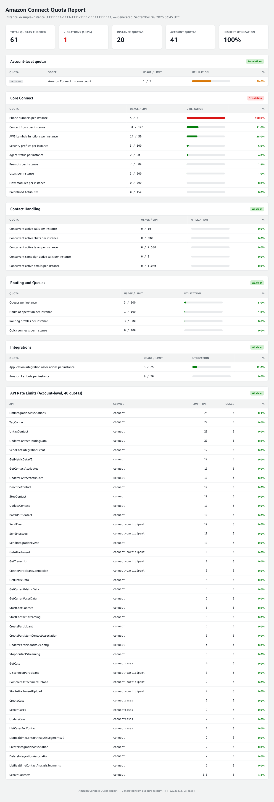
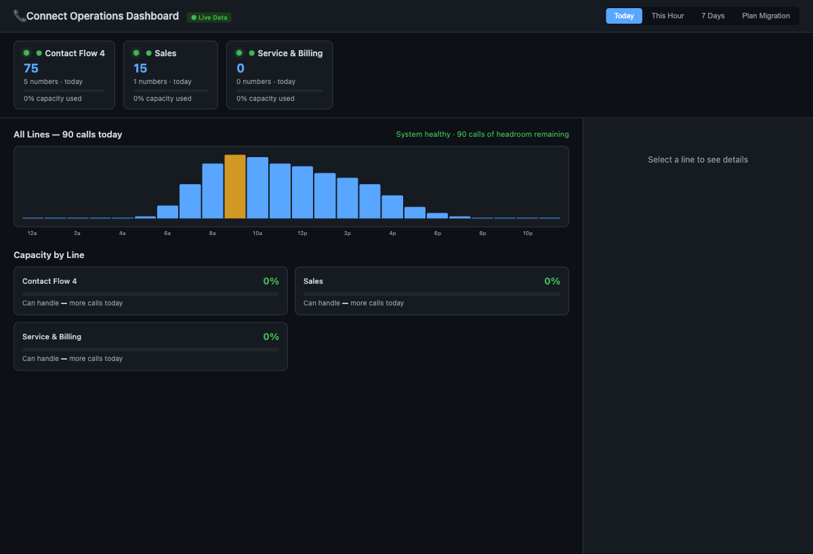
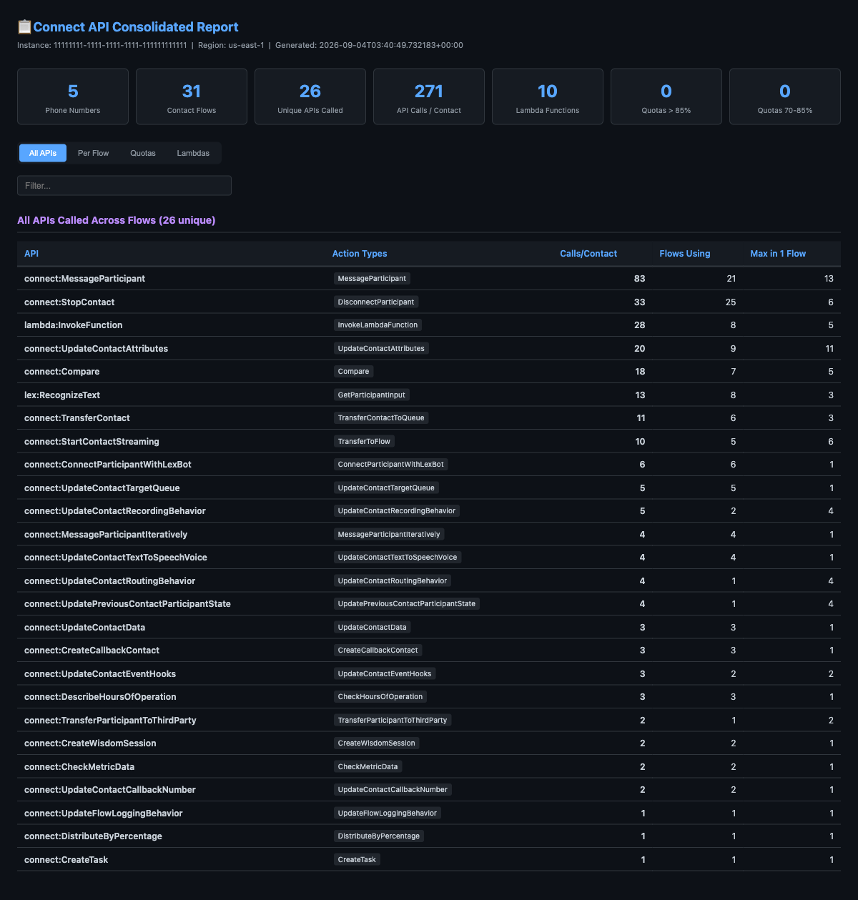

# Reports and dashboards

This tool produces three human-readable views on top of the raw JSON the monitor stores. Each comes from a different script, and each answers a different question. The screenshots below were generated against a real Connect instance and then had the instance name, IDs, account numbers, phone numbers, flow names, and Lambda names replaced with placeholders.

## 1. Quota limit report

Produced by `quota_report_to_html.py` from a monitor JSON report. This is the closest thing to "the report the monitor emails you, as a web page". Run it against a stored report:

```bash
aws s3 cp "s3://<your-bucket>/connect-reports/latest/latest-report.json" ./report.json
python3 quota_report_to_html.py ./report.json ./quota-report.html
open ./quota-report.html
```



What you are looking at:

- The tiles across the top summarize the run: how many quotas were checked, how many breached the threshold, and the single highest utilization figure.
- Quotas are grouped by category (Core Connect, Contact Handling, Routing and Queues, Integrations, API Rate Limits). Each group shows a small badge telling you whether anything in it breached.
- Every row is one quota with its current usage, its limit, and a utilization bar. Green is comfortable, amber is getting close, red is at or over the threshold. In this example "Phone numbers per instance" is at 5 of 5, so it shows red at 100 percent.
- The API Rate Limits table lists each throttling quota in transactions per second. An idle instance reads zero for most of these, which is expected, because the rate metrics only appear when those APIs are being called.

Use this when you want the full, current picture of where every quota sits.

## 2. Operations dashboard

Produced by `connect-resource-mapper.py` as `connect-dashboard.html`. This is a broader operational view organized around your business lines rather than raw quota codes.

```bash
python3 connect-resource-mapper.py --instance-id <YOUR_INSTANCE_ID> --region us-east-1 --output-dir ./output
open ./output/connect-dashboard.html
```



What you are looking at:

- The pills at the top are your business lines, grouped from contact flows and phone numbers using `line-config.json`. Each shows call volume and how much of its capacity is in use.
- The bar chart is call volume by hour of day.
- "Capacity by Line" shows headroom per line. When a line has no measured utilization yet, the headroom shows a dash rather than a number, because it cannot be derived from zero usage.
- The "Plan Migration" tab is a what-if planner for adding numbers or agents and seeing which API rate limits would be affected.

A note on accuracy: the per-line call volumes and the hourly curve are estimates derived from resource counts, not live traffic. The capacity percentages and the API rate figures are measured from CloudWatch and Service Quotas. Read the volume numbers as planning estimates, not as a traffic report.

## 3. Consolidated API report

Also produced by `connect-resource-mapper.py`, as `connect-api-report.html`. This one is about how your contact flows use APIs and Lambdas, which is what drives your API rate quotas.



What you are looking at:

- The tiles summarize the instance: phone numbers, contact flows, unique APIs called across all flows, total API calls per contact, and Lambda functions.
- The "All APIs" table lists every API your flows call, how many times per contact, how many flows use it, and the most any single flow uses it. This is where you find the APIs that will hit rate limits first as volume grows.
- The other tabs break the same data down per flow, per quota, and per Lambda.

Use this when you are investigating why a particular API rate quota is climbing, or planning a migration that will increase call volume.

## Where the raw data lives

All three views are rendered from data the monitor already collects. The monitor itself stores JSON in S3 (see the reports section in the main [README](../README.md)); the HTML views are a rendering step you run on top of that data. Nothing here needs a server. Every generated file is a single self-contained HTML document you can open directly or host on S3.
